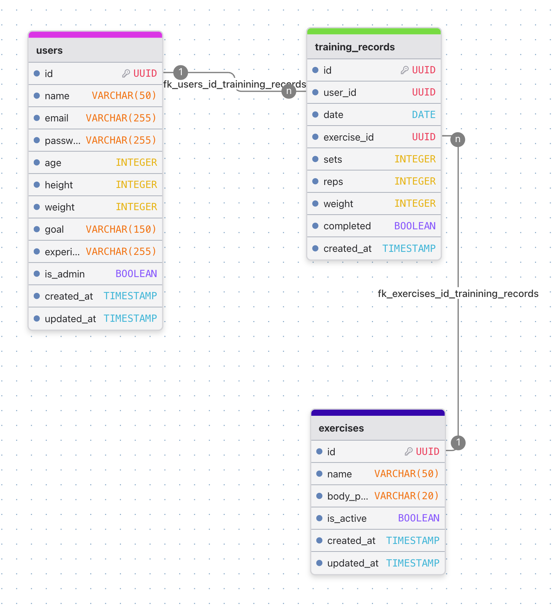

# SmartFit AI

筋トレ Todo アプリです。
AI によりパーソナライズされたトレーニングメニューを提供します。
また、トレーニングメニューの変更にも AI が対応しています。
レスポンシブに対応しており、スマートフォンやタブレットでも快適に使用できます。

## 使用技術

### バックエンド

-   **PHP (v8.2)**  
    サーバーサイドのメイン言語として使用しています。

-   **Laravel (v12.0)**  
    PHP の Web アプリケーションフレームワークで、アプリケーション全体の骨格を構築しています。

-   **Laravel Breeze**  
    認証機能（ログイン、新規登録、パスワードリセットなど）を迅速に実装するために使用しています。

### フロントエンド

-   **Blade**  
    Laravel 標準のテンプレートエンジンで、HTML の生成を行っています。

-   **Tailwind CSS (v3.1.0)**  
    ユーティリティファーストの CSS フレームワークで、UI のスタイリングを効率的に行っています。

-   **Vite**  
    高速なフロントエンドのビルドツールとして、開発環境の快適性を向上させています。

### データベース

-   **PostgreSQL (v17)**  
    アプリケーションのメインデータベースとして使用しています。

### インフラストラクチャ・開発環境

-   **Docker / Docker Compose**  
    アプリケーションの実行環境をコンテナ化し、開発環境の構築を容易にしています。

-   **Laravel Sail**  
    Docker ベースのローカル開発環境で、コマンドラインから手軽に環境を操作できます。

-   **pgAdmin4**  
    PostgreSQL データベースを管理するための GUI ツールです。

## ER 図

## ワイヤーフレーム

## 機能

1. 新規登録画面
2. ログイン画面  
   　 └ パスワードリセット画面
3. ホーム画面  
   　 ├ 本日のメニュー・チェック機能  
   　 ├ カレンダー＆統計画面  
   　 └ 週間メニュー画面（手動編集／AI 生成）  
   　　　 ├ 編集画面  
   　　　 └ 追加画面
4. AI チャット画面
5. 基本情報入力画面
6. 管理者画面（統計・ユーザー一覧・削除）
